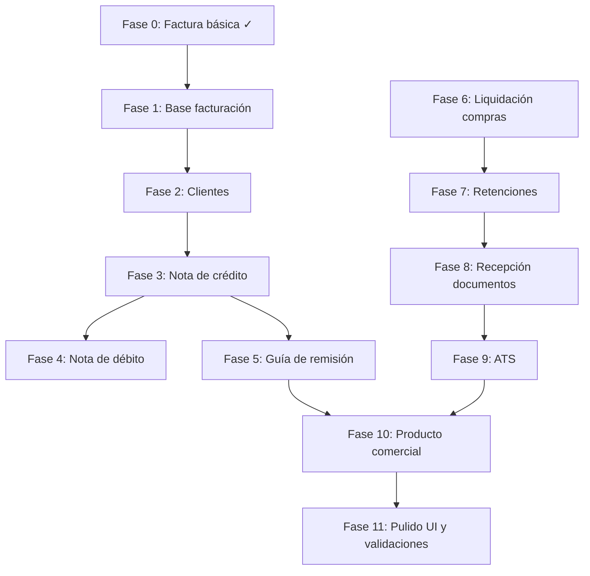

# Roadmap StockFlow → Facturación completa (paridad Ecuafact)

**Objetivo:** Evolucionar StockFlow de *inventario + factura SRI* a un **sistema de facturación electrónica completo** para Ecuador, comparable en comprobantes y flujos operativos a [Ecuafact](https://ecuafact.com/), usando la API de [Datil](https://datil.dev) como motor SRI.

**Enfoque:** Una fase a la vez. Cada fase cierra con pruebas en ambiente SRI de pruebas (`DATIL_AMBIENTE=1`) antes de pasar a la siguiente.

---

## Estado actual (Fase 0 — completada)

| Entregable | Estado |
|------------|--------|
| Login, productos, inventario, dashboard | ✓ |
| Factura con descuento de stock | ✓ |
| Consumidor final + cliente con datos | ✓ |
| Emisión SRI vía `POST /invoices/issue` | ✓ |
| Consulta estado vía `GET /invoices/{id}` | ✓ |
| Secuencial factura (`BillingSequence`) | ✓ |
| UI estado SRI en facturación | ✓ |

**Limitaciones conocidas:** un solo tipo de comprobante, un solo secuencial global, sin PDF/RIDE, sin clientes guardados, sin notas ni retenciones.

---

## Mapa de fases



| Fase | Nombre | Paridad Ecuafact* | Tiempo est. |
|------|--------|-------------------|-------------|
| 0 | Factura básica | ~15% | — |
| 1 | Base de facturación | ~25% | 1–2 sem |
| 2 | Catálogo de clientes | ~30% | 1 sem |
| 3 | Nota de crédito | ~45% | 2–3 sem |
| 4 | Nota de débito | ~50% | 1–2 sem |
| 5 | Guía de remisión | ~55% | 2 sem |
| 6 | Liquidación de compras | ~60% | 2 sem |
| 7 | Comprobantes de retención | ~70% | 3–4 sem |
| 8 | Recepción de documentos | ~80% | 3–4 sem |
| 9 | ATS | ~90% | 3–4 sem |
| 10 | Producto comercial | ~95% | 4–6 sem |
| 11 | Pulido UI y validaciones | ~98% | 2–3 sem |

\*Aproximado en **emisión y gestión de comprobantes**. Ecuafact además tiene años de soporte, app nativa, marca y escala — no es objetivo copiar eso al 100%.

---

## Arquitectura objetivo (refactor transversal)

Estas piezas se introducen en **Fase 1** y se reutilizan en todas las demás:

### Backend

```
service/
├── DatilClient.java          → ampliar: invoices, credit-notes, debit-notes,
│                               retentions, waybills, purchase-settlements
├── SriDocumentService.java   → nuevo: lógica común (payload, respuesta, refresh)
├── SriBillingService.java    → facturas (existente, refactor)
├── CreditNoteService.java    → Fase 3
├── DebitNoteService.java     → Fase 4
├── WaybillService.java       → Fase 5
├── PurchaseSettlementService → Fase 6
└── RetentionService.java     → Fase 7

model/
├── BillingSequence.java      → scopeKey por tipo: invoice, credit_note, debit_note,
│                               retention, waybill, purchase_settlement
└── SriDocument.java          → campos comunes (opcional: tabla base + herencia)
```

### Frontend

```
pages/
├── BillingPage.tsx           → facturas (existente)
├── CreditNotesPage.tsx       → Fase 3
├── DebitNotesPage.tsx        → Fase 4
├── WaybillsPage.tsx          → Fase 5
├── PurchaseSettlementsPage.tsx → Fase 6
├── RetentionsPage.tsx        → Fase 7
├── CustomersPage.tsx         → Fase 2
├── ReceivedDocumentsPage.tsx → Fase 8
└── AtsPage.tsx               → Fase 9

components/
└── SriDocumentStatus.tsx     → badge + refresh + clave acceso + número comprobante
```

### Secuenciales SRI

Cada tipo de comprobante lleva **secuencial propio** en el mismo establecimiento/punto de emisión:

| Tipo | scopeKey ejemplo | Endpoint Datil |
|------|------------------|----------------|
| Factura | `001-002-invoice` | `/invoices/issue` |
| Nota de crédito | `001-002-credit_note` | `/credit-notes/issue` |
| Nota de débito | `001-002-debit_note` | `/debit-notes/issue` |
| Retención | `001-002-retention` | `/retentions/issue` |
| Guía de remisión | `001-002-waybill` | `/waybills/issue` |
| Liquidación compras | `001-002-purchase_settlement` | `/purchase-settlements/issue` |

Registrar cada tipo en **SRI en línea** (autorización de comprobantes) antes de emitir en producción.

---

## Fase 1 — Base de facturación sólida

**Meta:** Que la factura actual sea la plantilla reutilizable para todos los comprobantes.

### Entregables

- [x] `DatilClient` con métodos genéricos: `issue`, `get`, `reissue` por recurso
- [x] Servicio común `SriDocumentFields.fromDatil()` (estado, clave acceso, autorización, errores)
- [x] `BillingSequence` por `establecimiento-punto-tipo` (no solo `default`)
- [x] Número de comprobante visible: `001-002-000000123`
- [x] Botón **Actualizar estado SRI** y **Reemitir** si aplica (`/invoices/:id/reissue`)
- [x] Descarga **RIDE/PDF** (URL desde Datil o `app.datil.co/ver/{id}/pdf`)
- [x] Pantalla detalle de factura (ítems, totales, datos SRI, error legible)
- [x] Prueba E2E: factura → `AUTORIZADO` → PDF descargable

### Criterio de “fase lista”

Emitir 3 facturas seguidas en pruebas SRI sin colisión de secuencial y ver el comprobante completo en la UI.

**Tiempo:** 1–2 semanas

---

## Fase 2 — Catálogo de clientes

**Meta:** No reescribir datos del cliente en cada factura.

### Entregables

- [x] Entidad `Customer` (nombre, identificación, tipo, email, dirección, teléfono)
- [x] CRUD `/api/customers`
- [x] Búsqueda al facturar (autocompletar)
- [x] Historial de facturas por cliente
- [x] Validación cédula/RUC (formato básico)

### Criterio de “fase lista”

Crear cliente una vez y emitir 2 facturas seleccionándolo desde el buscador.

**Tiempo:** 1 semana  
**Depende de:** Fase 1

---

## Fase 3 — Nota de crédito ✅

**Meta:** Anular o corregir facturas ya autorizadas (devoluciones, descuentos, errores).

### Entregables

- [x] Entidad `CreditNote` + ítems, vínculo a `Invoice` origen
- [x] Campos: motivo, secuencial, estado SRI, `datilId`
- [x] `POST /api/credit-notes` con referencia a factura (`num_doc_modificado`, etc.)
- [x] UI: “Crear nota de crédito” desde factura `AUTORIZADA` (no consumidor final)
- [x] Opción: NC total o parcial por ítems
- [x] Reintegro de stock configurable (al autorizar SRI)
- [x] Listado y detalle de notas de crédito (`/notas-credito`)
- [x] Secuencial propio en `billing_sequences` (`001-002-credit_note`)

### Criterio de “fase lista”

Factura autorizada → NC parcial → ambas `AUTORIZADO` en pruebas SRI. **Probado:** `001-002-000000017` + NC `001-002-000000017` **AUTORIZADO**.

**Nota:** El SRI/Datil no permite NC sobre facturas a **consumidor final**.

**Tiempo:** 2–3 semanas  
**Depende de:** Fases 1 y 2  
**Hito comercial:** Con Fase 3 puedes vender **paquete Profesional** a restaurantes y pymes.

---

## Fase 4 — Nota de débito ✅

**Meta:** Cobros adicionales sobre factura ya emitida (intereses, ajustes).

### Entregables

- [x] Entidad `DebitNote` vinculada a factura
- [x] `POST /api/debit-notes` + consulta + refresh + reemisión SRI
- [x] UI creación desde factura autorizada
- [x] Listado unificado “Documentos emitidos” (factura, NC, ND)

### Criterio de “fase lista”

Factura → ND por monto adicional → `AUTORIZADO` en pruebas. **Probado:** factura `001-002-000000020` + ND `001-002-000000020` **AUTORIZADO**.

**Tiempo:** 1–2 semanas  
**Depende de:** Fase 3

---

## Fase 5 — Guía de remisión ✅

**Meta:** Traslado de mercadería entre bodegas o hacia cliente (menos crítico en restaurante, sí en retail/distribución).

### Entregables

- [x] Entidad `Waybill` (transportista, destinatario, motivo traslado, ítems)
- [x] `POST /api/waybills` + consulta + refresh + reemisión SRI
- [x] Vinculación opcional a factura AUTORIZADA (documento de sustento)
- [x] UI emisión (`/guias-remision`) y consulta en listado unificado `/documentos`
- [x] Botón “Guía de remisión” desde factura AUTORIZADA en Facturación

### Criterio de “fase lista”

Guía emitida y autorizada en pruebas SRI. **Probado:** factura `001-002-000000021` + guía `001-002-000000021` **AUTORIZADO**.

**Tiempo:** 2 semanas  
**Depende de:** Fase 1

---

## Fase 6 — Liquidación de compras ✅

**Meta:** Documentar compras a proveedores sin RUC o régimen simplificado.

### Entregables

- [x] Entidad `Supplier` (catálogo proveedores)
- [x] Entidad `PurchaseSettlement` + ítems
- [x] `POST /api/purchase-settlements` + consulta + refresh + reemisión SRI
- [x] UI proveedores (`/proveedores`) y liquidaciones (`/liquidaciones-compra`)
- [x] Listado unificado en `/documentos`

### Criterio de “fase lista”

Liquidación de compra autorizada en pruebas. **Probado:** liquidación `001-002-000000023` **AUTORIZADO** (proveedor cédula, IVA 0%).

**Tiempo:** 2 semanas  
**Depende de:** Fase 1

---

## Fase 7 — Comprobantes de retención ✅

**Meta:** Paridad con Ecuafact en retenciones (solo aplica si el contribuyente es **agente de retención** en el SRI).

### Entregables

- [x] Config emisor: `DATIL_AGENTE_RETENCION`, resolución (flag local; Datil no acepta `agente_retencion` en payload)
- [x] Entidad `Retention` + impuestos retenidos (IVA, renta)
- [x] Documento sustento manual (número, tipo, fecha)
- [x] `POST /api/retentions` + consulta + refresh + reemisión SRI
- [x] Catálogo códigos retención SRI (`GET /api/retentions/tax-codes`)
- [x] UI `/retenciones` + listado en `/documentos`

### Criterio de “fase lista”

Retención emitida contra documento sustento de prueba → `AUTORIZADO`. **Probado:** retención `001-002-000000031` **AUTORIZADO** (renta 1% código 312, sustento `011-007-000000251`).

**Tiempo:** 3–4 semanas  
**Depende de:** Fases 1 y 6 (proveedores ayudan)

---

## Fase 8 — Recepción de documentos

**Meta:** Centralizar XML/PDF de facturas que **otros** te emiten (proveedores).

### Entregables

- [x] Upload XML autorizado o registro manual de factura recibida
- [x] Entidad `ReceivedDocument` (emisor, clave, total, IVA, sustento)
- [x] Listado, búsqueda, filtros por fecha/emisor
- [x] Clasificación: crédito tributario vs costo/gasto (códigos sustento)
- [x] Vínculo retención ↔ documento recibido

### Criterio de “fase lista”

Importar XML de prueba, verlo en listado y usarlo como sustento de retención. **Probado:** XML importado `011-007-000000251` → retención `001-002-000000033` **AUTORIZADO** vinculada al documento recibido.

**Usuario prueba Fase 8:** `fase8@stockflow.dev` / `test1234`

**Tiempo:** 3–4 semanas  
**Depende de:** Fase 7

---

## Fase 9 — ATS (Anexo Transaccional Simplificado)

**Meta:** Generar el archivo/reporte ATS que el SRI exige a muchos contribuyentes.

### Entregables

- [x] Consolidación ventas (emitidos) + compras (recibidos) por período
- [x] Validaciones de cuadre (totales, IVA)
- [x] Export formato compatible con carga SRI / herramienta contador
- [x] UI: seleccionar mes, revisar, exportar
- [x] Notas de venta / documentos no electrónicos (si aplica al cliente)

### Criterio de “fase lista”

Generar ATS de un mes de prueba con datos ficticios coherentes. **Probado:** junio 2026 — compra `011-007-000000900` ($1,150) + nota venta `NV-2026-0001` ($230) → preview cuadrado → export `AT062026.zip`.

**Usuario prueba Fase 9:** `fase9@stockflow.dev` / `test1234`

**Tiempo:** 3–4 semanas  
**Depende de:** Fases 8 y 3–7 (documentos emitidos y recibidos)

---

## Fase 10 — Producto comercial (pulido Ecuafact-like)

**Meta:** Lo que diferencia un “proyecto que factura” de un “producto vendible”.

### Entregables

- [x] **Proformas** (sin SRI, conversión a factura)
- [x] **Multi-establecimiento / multi-punto** de emisión
- [x] **Multi-RUC** (multi-tenant) si quieres SaaS — *una cuenta = un RUC; multi-sucursal vía puntos de emisión*
- [x] **Roles:** admin, cajero, contador (solo lectura ATS)
- [x] **Impresión térmica** / formato ticket POS
- [x] **Email automático** al cliente (PDF + XML) vía Datil o SMTP — *notificación registrada + enlace PDF Datil*
- [x] **PWA móvil** (facturar desde celular en el local)
- [x] Onboarding: wizard configuración SRI + Datil
- [x] Documentación usuario final (`GUIA-USUARIO.md`)

### Criterio de “fase lista”

Un negocio nuevo puede registrarse, configurar Datil, emitir factura + NC y exportar ATS sin tu ayuda manual. **Probado:** registro → onboarding → proforma → factura SRI → nota de crédito → ATS.

**Usuario prueba Fase 10:** `fase10@stockflow.dev` / `test1234`

**Tiempo:** 4–6 semanas  
**Depende de:** Fases 1–9

---

## Fase 11 — Pulido UI y validaciones

**Meta:** Revisión transversal del producto para que se sienta profesional, coherente y a prueba de errores del usuario antes de entrega comercial.

### Entregables

- [x] **Auditoría de flujos** — E2E SRI pruebas junio 2026 (`scripts/e2e-fase11.ps1`) **Probado:** factura + NC + retención `001-002-000000051` + sustento `011-007-000000251` **AUTORIZADO** + ATS ZIP
- [x] **Design system ligero** — `PanelField`, `TaxIdField`, utilidades `validation.ts`, estados de error por campo
- [x] **Validaciones frontend** — RUC/cédula, email, códigos SRI (estab./pto.), montos, reglas de negocio visibles *(pantallas críticas)*
- [x] **Validaciones backend** — RUC en perfil de negocio, códigos de emisión, mensajes claros
- [x] **Pantallas críticas** — Facturación, Clientes, Proveedores, Onboarding, Configuración
- [x] **Pantallas contables** — Retenciones, Documentos recibidos, ATS
- [x] **Resto de comprobantes** — NC, ND, guías, liquidaciones, proformas *(validaciones + avisos)*
- [x] **UX operativa** — confirmaciones, estados vacíos, botones deshabilitados al emitir
- [x] **Responsive + PWA** — tablas en móvil, iconos manifest *(SVG + CSS responsive)*

### Checklist auditoría (Fase 11)

| Flujo | Validar UI | Validar campos | Móvil |
|-------|------------|----------------|-------|
| Registro / login | ✅ | ✅ | ✅ |
| Onboarding (4 pasos) | ✅ | ✅ | ✅ |
| Productos | ✅ | ✅ | ✅ |
| Clientes / proveedores | ✅ | ✅ | ✅ |
| Facturación + ticket | ✅ | ✅ | ✅ |
| Proformas → factura | ✅ | ✅ | ✅ |
| Nota de crédito / débito | ✅ | ✅ | ✅ |
| Guía de remisión | ✅ | ✅ | ✅ |
| Liquidación compras | ✅ | ✅ | ✅ |
| Retenciones | ✅ | ✅ | ✅ |
| Docs recibidos (XML) | ✅ | ✅ | ✅ |
| ATS export | ✅ | ✅ | ✅ |
| Configuración | ✅ | ✅ | ✅ |

### Criterio de “fase lista”

Un usuario nuevo completa onboarding → factura → NC → importa XML → retención → exporta ATS **sin ayuda**, con mensajes de validación claros en cada paso y sin pantallas rotas en móvil.

**Tiempo:** 2–3 semanas  
**Depende de:** Fase 10

---

## Qué NO está en el roadmap (o queda explícitamente fuera)

| Función Ecuafact | Decisión |
|------------------|----------|
| App nativa iOS/Android | Fase 10 solo PWA; app nativa solo si hay demanda |
| Soporte 8x5 / WhatsApp comercial | Operación tuya, no código |
| Plan gratis 30 docs | Modelo de negocio distinto (tú cobras implementación) |
| Firma electrónica incluida | Cliente contrata firma; tú integras vía Datil |
| Integración ERP de terceros | Fuera de alcance inicial; API REST propia al final |

---

## Orden de trabajo recomendado (sprint a sprint)

| Sprint | Fase | Entrega visible al cliente |
|--------|------|----------------------------|
| 1 | Fase 1 | Factura “profesional” con PDF y número SRI completo |
| 2 | Fase 2 | Clientes guardados |
| 3 | Fase 3 | Nota de crédito (devoluciones) |
| 4 | Fase 4 | Nota de débito |
| 5 | Fase 5 o 6 | Según vertical: guía (retail) o liquidación compras (compras) |
| 6 | Fase 7 | Retenciones |
| 7–8 | Fases 8–9 | Contador feliz: recepción + ATS |
| 9+ | Fase 10 | Producto SaaS / multi-local |
| 10+ | Fase 11 | Pulido UI, validaciones, listo para cliente |

**Restaurante (cliente actual):** Fases **1 → 2 → 3** cubren el 90% de lo que pedirán. Retenciones y ATS solo si son agente de retención u obligados a ATS.

---

## Checklist de registro en SRI (por cada nuevo comprobante)

Antes de emitir en **producción** cada tipo:

1. [SRI en línea](https://srienlinea.sri.gob.ec) → Facturación electrónica → Registro de emisión  
2. Autorizar tipo de comprobante (NC, ND, retención, etc.)  
3. Anotar secuencial inicial  
4. Configurar en Datil (app.datil.co) el mismo establecimiento/punto  
5. Probar en `DATIL_AMBIENTE=1`  
6. Pasar a `DATIL_AMBIENTE=2` con factura real pequeña  

---

## Seguimiento de progreso

Actualiza esta tabla al cerrar cada fase:

| Fase | Estado | Fecha inicio | Fecha cierre | Notas |
|------|--------|--------------|--------------|-------|
| 0 | ✅ Completada | — | — | Factura AUTORIZADO en pruebas |
| 1 | ✅ Completada | 2026-06-17 | 2026-06-17 | Factura 001-002-000000011 AUTORIZADO + PDF |
| 2 | ✅ Completada | 2026-06-17 | 2026-06-17 | CRUD clientes + búsqueda en facturación |
| 3 | ✅ Completada | 2026-06-17 | 2026-06-17 | Notas de crédito SRI |
| 4 | ✅ Completada | 2026-06-17 | 2026-06-17 | Notas de débito SRI |
| 5 | ✅ Completada | 2026-06-17 | 2026-06-17 | Guías de remisión |
| 6 | ✅ Completada | 2026-06-17 | 2026-06-17 | Liquidaciones de compra |
| 7 | ✅ Completada | 2026-06-17 | 2026-06-17 | Retenciones |
| 8 | ✅ Completada | 2026-06-18 | 2026-06-18 | Documentos recibidos |
| 9 | ✅ Completada | 2026-06-18 | 2026-06-18 | ATS export ZIP |
| 10 | ✅ Completada | 2026-06-18 | 2026-06-18 | Producto comercial: onboarding, proformas, roles, PWA |
| 11 | ✅ Completada | 2026-06-10 | 2026-06-18 | E2E completo: UI/validaciones + retención SRI OK |
| 12A | ✅ Completada | 2026-06-18 | 2026-06-18 | Cuenta Factuplan + sandbox `ak_test_*` |
| 12B | Abstracción `SriInvoicePort` + `FactuplanClient` + facturas + API certificado | ✅ |
| 12C | Wizard UI: subir P12, probar emisión, membresía | ✅ |
| 12D | NC, retención, guía, liquidación, ND + webhooks | ✅ |
| 13 | Cobro membresías PayPhone (Ecuador) + suspensión; Stripe opcional | ✅ Completado |

Guía: [SETUP-FACTUPLAN.md](./SETUP-FACTUPLAN.md) · [SETUP-MEMBRESIAS.md](./SETUP-MEMBRESIAS.md)

---

## Referencias

- API Datil: [datil.dev](https://datil.dev)  
- Setup actual: [SETUP-DATIL-LITE.md](./SETUP-DATIL-LITE.md)  
- Comparativa comercial: [propuestas/restaurante-facturacion/README.md](../../propuestas/restaurante-facturacion/README.md)

---

*Última actualización: junio 2026*
